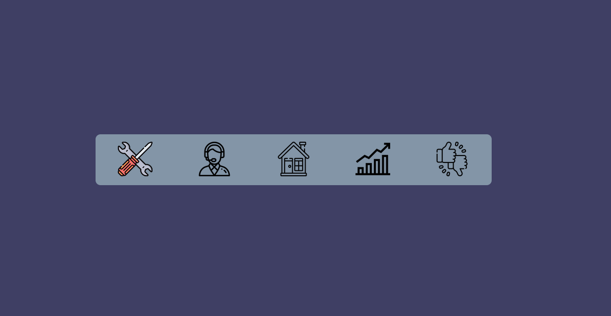

### Welcome back, guys. ✌ In this article you will be learning how to create this beautiful navigation bar with HTML, CSS, and a little bit of JavaScript. This is a quick preview of what we are going to create today. 👇



It is very easy and simple to understand. So let's make this 😉. I have discussed step by step how to create this and at the end, there is a complete code also.

# **HTML CODE**

```html
<nav>
  <ul>
    <li>
      <span data-color="#3f3f64">
        
        
      </span>
    </li>

    <li>
      <span data-color="#794343">
        
        
      </span>
    </li>

    <li>
      <span data-color="#8be8ff">
        
        
      </span>
    </li>

    <li>
      <span data-color="#f7a11fa2">
        
        
      </span>
    </li>

    <li>
      <span data-color="#b33136">
        
        
      </span>
    </li>
  </ul>
</nav>
```

So as this is a navigation bar I decided to use the <code>\<nav></code> element to create this. Everything is inside the <code>\<nav></code> tag, and there is an unordered list in it to create the links.

## **CSS for Nav Bar**

```css
nav {
  width: 50%;
}

nav ul {
  list-style-type: none;
  overflow: hidden;
  display: flex;
  align-items: center;
  justify-content: space-around;
  background-color: #8395a7;
  border-radius: 10px;
}
```

Created a flex box and <code>justify-content: space-around</code> to create equal spaces between images. <code>list-style-type: none</code> to remove the bullets and <code>overflow: hidden</code> to avoind overflowing the content. set a <code>bacground-color</code> and <code>border-radius</code> to look better. 😏

### **\<li> Tag**

```html
<span data-color="#3f3f64">
  
  
</span>
```

The images are created inside the <code>\<span></code> tag. And you can see there are two images inside the<code>\<span></code> tag. One is the black and white and the other is color image. the <code>data-color</code> attribute in the<code>\<span></code> tag is made for the function of JavaScript. You can see it at the end of this article.

```css
nav ul li span {
  display: block;
  padding: 15px 0;
  cursor: pointer;
  position: relative;
}
```

These are the stylings for <code>\<span></code> tag. <code>display: block</code> unless we can't change the padding values because it is a inline element by default. <code>position: relative</code> because the colored image is going to be absolute to that element.

```css
img {
  width: 70px;
}
```

Set an fixed <code>width</code> to the image.

The most important part is positioning the colored image. I position the colored image right in front of the black and white image. So that the black and white image is under the colored image. Then I set the colored image's<code>opacity: 0</code> so that the colored image cannot be seen. But still, the colored image is in front of the black and white image. So the hover effect is to bring back the opacity with a transition. And it will be like an animation of color-changing 😁.

```css
.color-image {
  position: absolute;
  left: 0;
  opacity: 0;
  transition: all 0.25s;
}

.color-image:hover {
  opacity: 1;
}
```

👍 _So here is the complete CSS code for the project._

```css
* {
  box-sizing: border-box;
  padding: 0;
  margin: 0;
}

body {
  width: 100%;
  height: 100vh;
  display: flex;
  align-items: center;
  justify-content: center;
  transition: all 1s;
  background-color: #3f3f64;
}

nav {
  width: 50%;
}

nav ul {
  list-style-type: none;
  overflow: hidden;
  display: flex;
  align-items: center;
  justify-content: space-around;
  background-color: #8395a7;
  border-radius: 10px;
}

nav ul li span {
  display: block;
  padding: 15px 0;
  cursor: pointer;
  position: relative;
}

img {
  width: 70px;
}

.color-image {
  position: absolute;
  left: 0;
  opacity: 0;
  transition: all 0.25s;
}

.color-image:hover {
  opacity: 1;
}
```

## **JAVASCRIPT**

This is the JavaScript part. It is very simple. All it does is change the <code>background-color</code> of the document when an icon is clicked. (Just for fun 😂). So here it is...

```javascript
const link = document.querySelectorAll("span"); // Getting all the span elements
const body = document.querySelector("body"); // Getting the body

link.forEach((item) => {
  item.addEventListener("click", () => {
    const bodyColor = item.dataset.color;
    body.style.backgroundColor = bodyColor;
  });
});
```

So in here I have selected all the <code>\<span></code> elements using <code>querySelectorAll</code> and when a <code>\<span></code> element is clicked, it takes the <code>data-color</code> attribute of that element and set that color as the <code>bacground-color</code> of the document.

## 🔗 **LINKS**

- Link to the [Github Repository](https://github.com/Pasindu-Uthum/nav-bar-animation)
- Follow me on [Twitter](https://twitter.com/PasinduUthum)
- Follow me on [Instagram](https://www.instagram.com/pasindu_uthum/)
- Download SVG icons from [flaticon](https://www.flaticon.com/)

Leave a like 👍 and share 🤙 this article to your friends so that they will also learn what you learned from this. Comment 💬 down you ideas about this,
